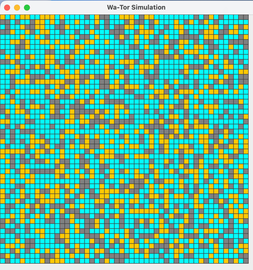
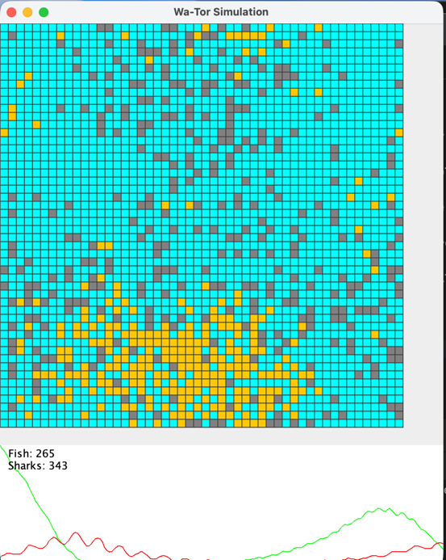
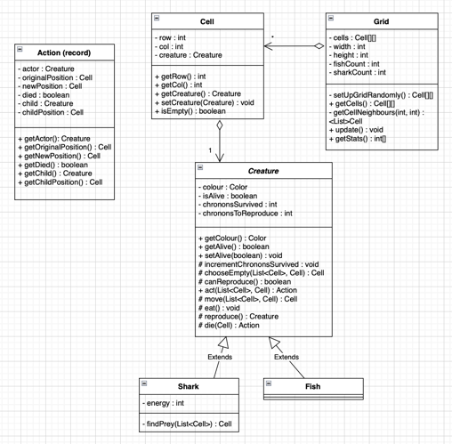

# Wa-Tor

## Background

Wa-Tor is a predator-prey simulation, initially devised by A. K. Dewdney and described on [page 14 of the December 1984 issue of Scientific American](https://static.scientificamerican.com/sciam/cache/file/7F8FAF26-9FDB-4B8F-86E7F87997E0072E.pdf).

The idea is that sharks and fish fight on the planet Wa-Tor. The sharks are predatory and eat the fish. Both sharks and fish live, move, reproduce and die in Wa-Tor according to the simple rules defined below.

The balance of this ecosystem is quite delicate, and there are three possible outcomes: the number of sharks and fish are balanced, and fluctuate, the sharks become extinct, or both species become extinct.

Fish are represented in orange, sharks are represented with grey, and water / empty cells are in blue.

Initially, the 'world' is set up where each cell has a 25% change of becoming a shark and a 25% chance of becoming a fish. An example initial world is shown below.

When the simulation runs, the population of each creature is shown. In the image below, the shark and fish populations are balanced.

## Rules
1. Sharks are predatory & eat the fish 
2. Sharks and fish live, move, reproduce and die 
3. If a creature moves past the edge of the grid, it reappears on the opposite side (toroidal world)
4. Time passes in discrete jumps (called chronons)
5. Fish have the following behaviour:
   - At each jump, a fish moves randomly to an adjacent opposite square. If there are no free squares, no movement takes place. 
   - When a fish survives a certain number of jumps, it can reproduce by moving and leaving a new fish in its old position
6. Sharks have the following rules:
   - At each jump, a shark moves to an adjacent square occupied by a fish, or a random adjacent sqaure if there are no fish. If there are no free squares, no movement takes place.
   - At each jump, a shark loses a unit of energy 
   - Upon reaching zero energy, the shark dies 
   - If a shark moves to a square occupied by a fish, it eats the fish and earns a certain amount of energy. 
   - Once a shark has survived a certain number of chronons it may reproduce in exactly the same way as the fish.

## OOP design

**Question: how to model the creature's actions?** Considered using coupled(?) composition where the Creature has a Grid 
and the Grid has Creatures, but this seems messy. Other alternatives were association, where the Grid was passed into
each creature and it then updates it directly. Decided on an Action class (Command Design Pattern?) so that Creatures
return their desired action and the grid then actually executes it - but not sure if this is standard.

The model part (how the creatures move) has the following UML diagram:

## Possible extensions

1. Adding in more species - overarching Predator / Prey interface or class that different creatures can then extend.
2. Adding in food for the fish - the sharks could then gain this energy when they eat a fish
   - the shark's hunting strategy could be weighted towards higher energy fish
3. Death on overpopulation
4. Allowing the user to draw the starting populations onto the grid